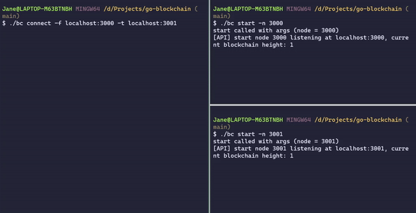
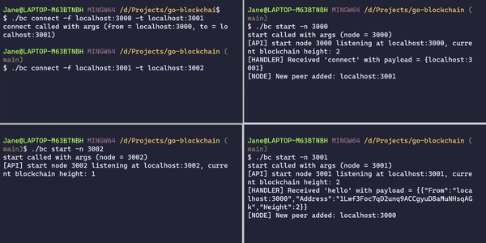
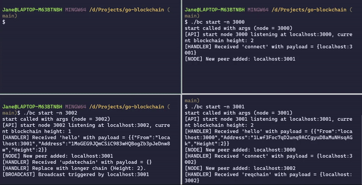
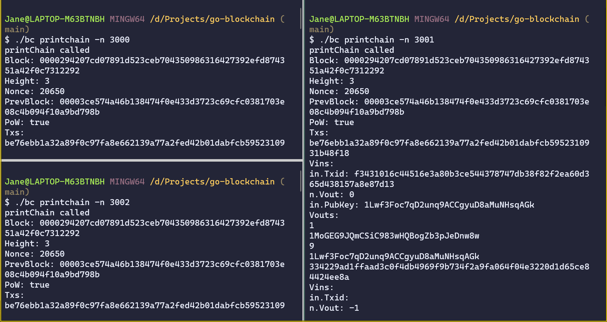

# go-blockchain
A basic blockchain implementation in Golang.

## Installation and Usage

### CLI Usage
We provide a command line tool to setup a blockchain on your machine.

The CLI is powered by [cobra](https://github.com/spf13/cobra), which is a library for creating powerful modern CLI applications as well as a program to generate applications and command files.

run `go build -o bc main.go` to compile the project, then run `./bc -h` to get information about the cli.

Here is a sample output, it is not a stable version, we're still woking on it.
```
Gobc is a simplified blockchain implemented in Go

Usage:
  gobc [flags]
  gobc [command]

Available Commands:
  address     Get the address of the given node
  completion  generate the autocompletion script for the specified shell
  connect     Connect a node to another
  getbalance  Get the balance of the given address
  help        Help about any command
  newnode     Create a new node with given port, the port number will also be used as node id
  printchain  Print all the blocks of the blockchain
  send        Send a message from a node to another
  start       Start the node running on given port

Flags:
      --config string   config file (default is $HOME/.gobc.yaml)
  -h, --help            help for gobc

Use "gobc [command] --help" for more information about a command.
```

### How to Run
:triangular_flag_on_post: **Run commands below under the project root**

1. run `go build -o bc main.go` to build the project

2. run `./bc newnode -p [port]` to create node

    :point_down: **Example**
    ```go
    $ ./bc newnode -p 3002
    newnode called with args (port = 3002)
    New node 3002 created with address 1JZrjSBdRekhjDm7e1ugpUFMQrdcdkp9V
    ```

    if you forget a node's address, run `./bc address -n [node]` to get it, noted `node` is same as the `port` you used in `newnode`

    :point_down: **Example**
    ```go
    $ ./bc address -n 3000
    address called for node 3000
    Node #3000 address: 1492uKSSigtUACJt9TvfuXUDkddhXRBkdx
    ```

3. run `./bc start -n [node]` to start the nodes in each terminal, the nodes will listen at `localhost:[port]`

    :point_down: **Example**
    ```go
    $ ./bc start -n 3000
    start called with args (node = 3000)
    [API] start node 3000 listening at , current blockchain height: 2
    ```

3. open a new terminal and run `./bc connect -f [from] -t [to]` to connect these nodes

    * `from` - the IP address of the sender node
    * `to` - the IP address of the receiver node

    :point_down: **Example 1**
    ```go
    ./bc connect -f localhost:3000 -t localhost:3001
    ```

    

    :point_down: **Example 2** - the nodes will synchronize their blockchains based on the longest chain rule when they are connected

    

4. run `./bc send -f [from] -t [to] -m [amount] -a [address] -n [node]` to trigger a node to do transactions and  mine a new block:

    * from - an array of base58 address of the sender in transactions
    * to - an array of base58 address of the receviers in transactions
    * amount - an array of amount of tokens in transactions
    * address - base58 address of the miner, who will get the rewards
    * node - id of the node who will do these transactions

    :point_down: **Example**
    ```go
    ./bc send -f '["1492uKSSigtUACJt9TvfuXUDkddhXRBkdx"]' -t '["1Pb7o1vLbnPnFVHgdz35nVjfgEB2Y5NjAt"]' -m '["1"]' -a 1Pb7o1vLbnPnFVHgdz35nVjfgEB2Y5NjAt -n 3000
    ```

    when a new block is created, the node will broadcast it to all its known peers.
    

5. run `./bc printchain -n [node]` to print the blockchain on the node

    :point_down: **Example** - this screenshot shows that the blockchains on three connected nodes are synchronized after a `send` command is triggered.

    
